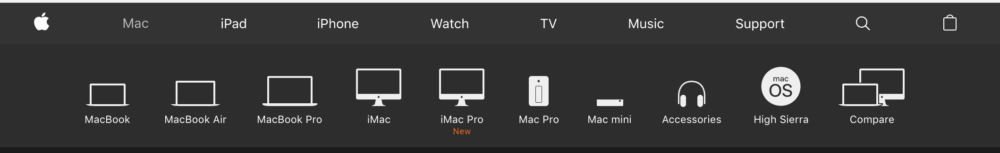

<<<<<<< HEAD
This project was bootstrapped with [Create React App](https://github.com/facebook/create-react-app).

## Available Scripts

In the project directory, you can run:

### `npm start`

Runs the app in the development mode. 
Open [http://localhost:3000](http://localhost:3000) to view it in the browser.

The page will reload if you make edits. 
You will also see any lint errors in the console.

### `npm test`

Launches the test runner in the interactive watch mode. 
See the section about [running tests](https://facebook.github.io/create-react-app/docs/running-tests) for more information.

### `npm run build`

Builds the app for production to the `build` folder. 
It correctly bundles React in production mode and optimizes the build for the best performance.

The build is minified and the filenames include the hashes. 
Your app is ready to be deployed!

See the section about [deployment](https://facebook.github.io/create-react-app/docs/deployment) for more information.

### `npm run eject`

**Note: this is a one-way operation. Once you `eject`, you can’t go back!**

If you aren’t satisfied with the build tool and configuration choices, you can `eject` at any time. This command will remove the single build dependency from your project.

Instead, it will copy all the configuration files and the transitive dependencies (Webpack, Babel, ESLint, etc) right into your project so you have full control over them. All of the commands except `eject` will still work, but they will point to the copied scripts so you can tweak them. At this point you’re on your own.

You don’t have to ever use `eject`. The curated feature set is suitable for small and middle deployments, and you shouldn’t feel obligated to use this feature. However we understand that this tool wouldn’t be useful if you couldn’t customize it when you are ready for it.

## Learn More

You can learn more in the [Create React App documentation](https://facebook.github.io/create-react-app/docs/getting-started).

To learn React, check out the [React documentation](https://reactjs.org/).
=======
# React Router Apple Nav - Stretch Assignment

* Lets build out an navigation app that mimics `Apple's Slick Navigation` from their marketing website. At this point you have all the knowledge you'll need to be able to complete this stretch assignment.

## **NOTE** This repository is to be used as a Stretch Assignment

* Now that you have played around with Routing and have been building out some nested routes etc. It's time to get you into a little more practice. Remember that repetition is key.
* The idea here is to build out a replica of Apple's navigation.
* Build out a menu similar to the one on https://www.apple.com with a top level navigation.

## Project

* Use _create-react-app_ to make an application, name it `apple-nav`.
* You'll need to build out a few components here. Some variation of a `NavWrapper` component which will be your navigation header.
* You'll need a reusable `Nav` component that you can turn into a navigation link for each parent category.
* Lastly you're going to need some sort of `SubNav` component, that will be reusable and display your sub-navigation links for each category.

### Stretch Problem

* Once you are finished with the Navigation and SubNavigation components you'll be able to look into ways to extend this application by adding some smooth transitions. Look into [this article](https://hackernoon.com/animated-page-transitions-with-react-router-4-reacttransitiongroup-and-animated-1ca17bd97a1a) for an example of how this can be achieved.

This example shows the sub-navigation for the `/mac` route.

>>>>>>> 8942307a8a7fc67c8aad32452b12a7d4ca7fec6d
